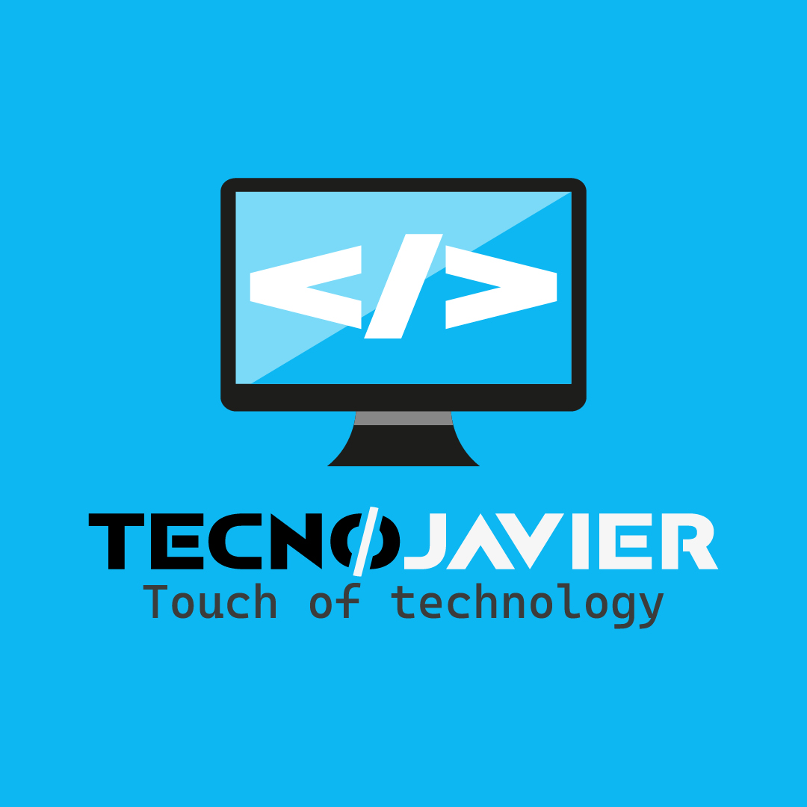

<h3 align="center">Hi there! My name is <strong><i>Javier Bonilla</i></strong> 👋</h3>

```js
cons tecnojavier = {
  pronouns: "he" | "him",
  code: [PHP, JavaScript, CSS, HTML5, Java, C#, Python],
  frameworks: [Laravel],
}
```

<div class="img">
  
</img>

<!DOCTYPE html>
<html>
  <head>
  </head>
  
<body>
  <div class="card" style="display: inline-block; width: 18rem;" align="center">
    
      <div class="card-body" width="20%">
      <h5 class="card-title">Juan Javier Bonilla Maldonado</h5>
      <p class="card-text">I am a <strong><i>Professional Computer</i></strong> <strong><i>Systems Technician</i></strong>
                            with a specialty in <strong><i>Applied Robotics with Arduino</i></strong>. <br>
                            I have dedicated my free time to training independently and by my own means, <br>
                            in web development and Windows application programming. With courses on different 
                            free platforms and others on YouTube. <br> I am dedicated to computer support and 
                            maintenance, security system installations and, <br> above all, the development
                            of web sites and applications.</p>
  </div>
  </div>

  ```
    <div class="card" style="display: inline-block; width: 18rem;" align="center">
    
      <div class="card-body" width="20%">
      <h5 class="card-title">Juan Javier Bonilla Maldonado</h5>
      <p class="card-text">I am a <strong><i>Professional Computer</i></strong> <strong><i>Systems Technician</i></strong>
                            with a specialty in <strong><i>Applied Robotics with Arduino</i></strong>. <br>
                            I have dedicated my free time to training independently and by my own means, <br>
                            in web development and Windows application programming. With courses on different 
                            free platforms and others on YouTube. <br> I am dedicated to computer support and 
                            maintenance, security system installations and, <br> above all, the development
                            of web sites and applications.</p>
  </div>
  </div>
```
  
  <div class="card" style="display: inline-block; width: 18rem;" align="center">
    
      <div class="card-body" width="20%">
      <h5 class="card-title">TecnoJavier</h5>
      <p class="card-text">Committed to providing solutions to technological problems. 
                          Installation of security <br> systems for which we have personnel 
                          for installations of different types. <br> Also, we are dedicated 
                          to the development of applications and websites. 
                          <p><strong>Start date:</strong> January 20, 2022</p>
  </div>
  </div>
  
</body>
</html>

```
  <div class="card" style="display: inline-block; width: 18rem;" align="center">
    
      <div class="card-body" width="20%">
      <h5 class="card-title">TecnoJavier</h5>
      <p class="card-text">Committed to providing solutions to technological problems. 
                          Installation of security <br> systems for which we have personnel 
                          for installations of different types. <br> Also, we are dedicated 
                          to the development of applications and websites. 
                          <p><strong>Start date:</strong> January 20, 2022</p>
  </div>
  </div>
```

<!--
**tecnojavier/tecnojavier** is a ✨ _special_ ✨ repository because its `README.md` (this file) appears on your GitHub profile.

Here are some ideas to get you started:

- 🔭 I’m currently working on ...
- 🌱 I’m currently learning ...
- 👯 I’m looking to collaborate on ...
- 🤔 I’m looking for help with ...
- 💬 Ask me about ...
- 📫 How to reach me: ...
- 😄 Pronouns: ...
- ⚡ Fun fact: ...
-->
